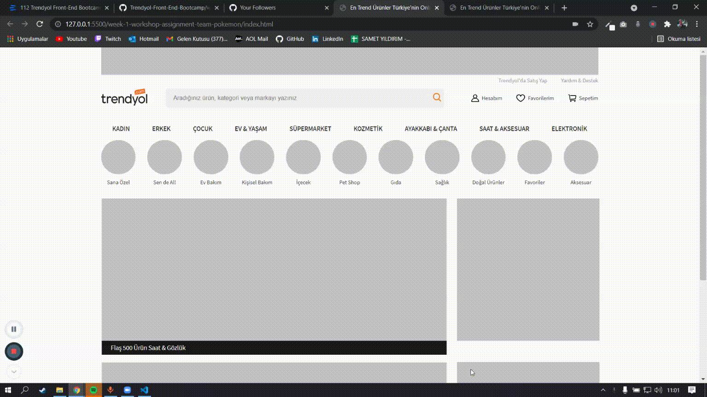

# Trendyol Front-End Bootcamp Week1 Homework - Trenyol Landing Page Clone

Trendyol Landing Page Clone is the open source code of Front-End Bootcamp's first assignment, which we have progressed with [Trenyol Group](https://trendyol.github.io/), [Patika](https://www.patika.dev/) and [Kodluyoruz](https://www.kodluyoruz.org).

## Built With

- HTML5
- CSS3

## Getting Started

First we need to clone the repo.

### Clone Repo

```sh
git clone https://github.com/Trendyol-Front-End-Bootcamp/week-1-workshop-assignment-team-pokemon.git
```

## Roadmap

See the [open issues](https://github.com/Trendyol-Front-End-Bootcamp/week-1-workshop-assignment-team-pokemon/issues) for a list of proposed features (and known issues).

## Contributing

Contributions are what make the open source community such an amazing place to be learn, inspire, and create. Any contributions you make are **greatly appreciated**.

1. Fork the Project
2. Create your Feature Branch (`git checkout -b feature/AmazingFeature`)
3. Commit your Changes (`git commit -m 'Add some AmazingFeature'`)
4. Push to the Branch (`git push origin feature/AmazingFeature`)
5. Open a Pull Request

## Contributors

- [@mahmudmardini](https://github.com/mahmudmardini)
- [@korayizlimek](https://github.com/korayizlimek)
- [@DANYELKAR](https://github.com/DANYELKAR)
- [@kayraberktuncer](https://github.com/kayraberktuncer)
- [@gokcecicek](https://github.com/gokcecicek)
- [@erenozger](https://github.com/erenozger)
- [@gizayeroglu](https://github.com/gizayeroglu)
- [@yildirimsamet](https://github.com/yildirimsamet)

## Figma

[Figma Design](https://www.figma.com/file/IwnhPC5WBglAFGc0MJ6wXj/Trendyol-Front-End-Bootcamp?node-id=0%3A1)

## Preview



##


## License

[MIT](LICENSE)
