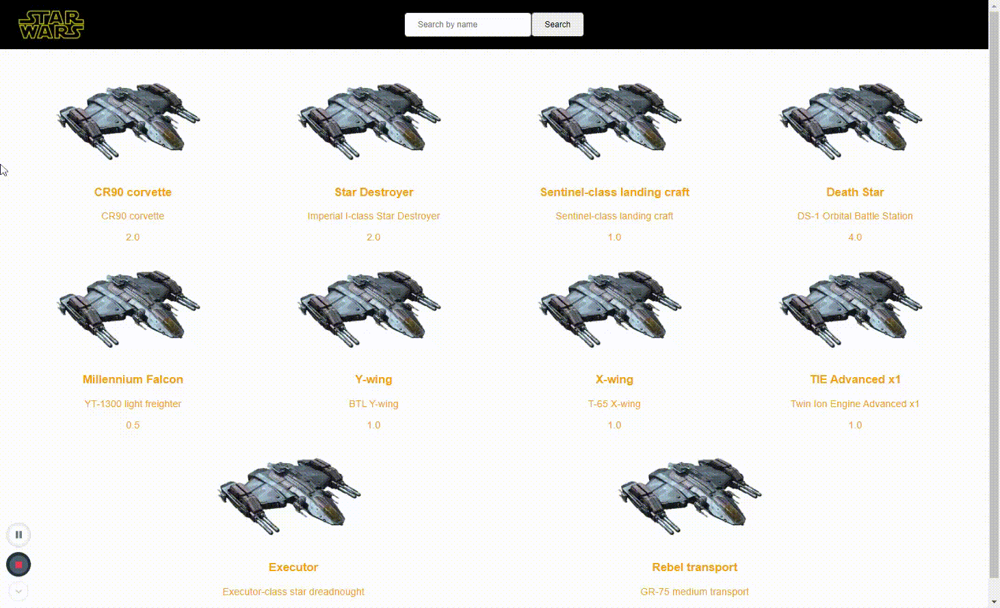

# Trendyol frontend bootcamp VueJS homework
### About Project
#### A simple vue app that uses vue-router and [swapi.dev](https://swapi.dev/)

## How to install
- clone project
- yarn install
- yarn dev

## Preview

